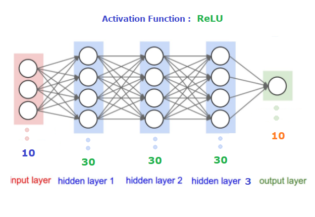
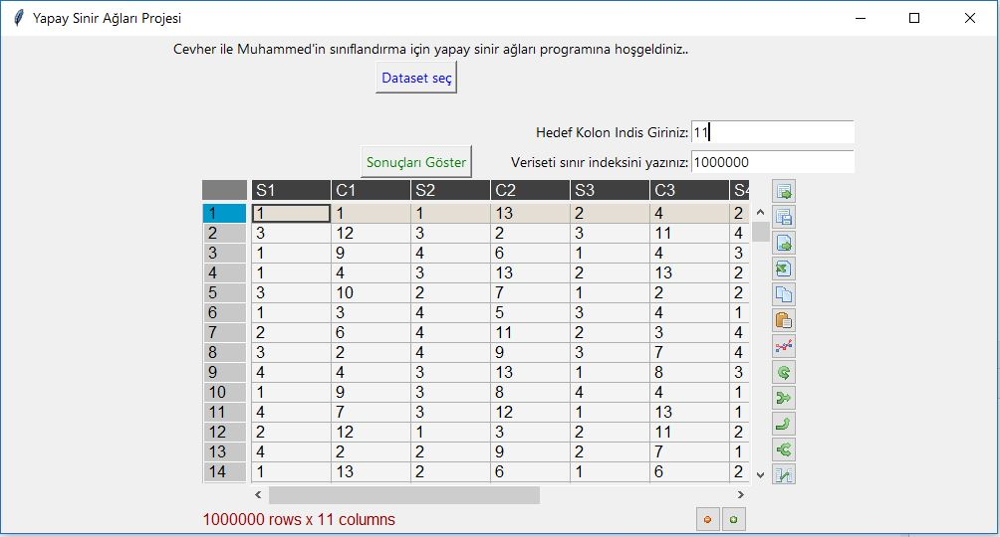
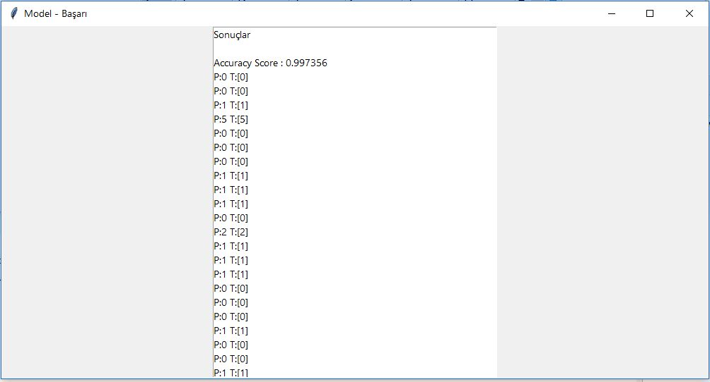

<h1>Yapay Sinir Ağları (ANN/YSA) ile Poker-Hand Veriseti</h1>

<ul>
 <li>Bu çalışmada bir yapay sinir ağı tasarlanmış ve paker hand veri setine uygulanmıştir.   
 Aşağıdaki görselde de görüldüğü üzere sinir ağı <b><i>giriş katmanı, 3 adet 30 nöronlü gizli katman ve 10 nöronlu  çıkış katmanından</i></b>  oluşmaktadır.
   Ayrıca aktivasyon fonksitonu olarakta bütün katmanlar için <b><em>ReLU</em></b> kullanılmıştır. 
 </li>
</ul>

<ul>
 <li>Çalışma sonucunda accuracy score <b><em>0,9973</em></b> elde edilmiştir.</li> 
</ul>

<h3>Ekran Görüntüleri</h3>
 
 
<h5>Anasayfa</h5>

 
<h5>Sonuç Ekranı</h5>

